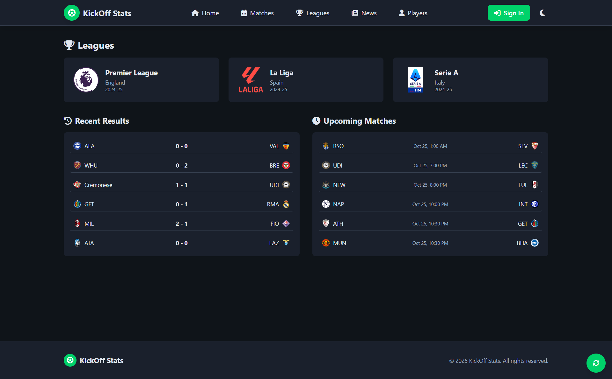
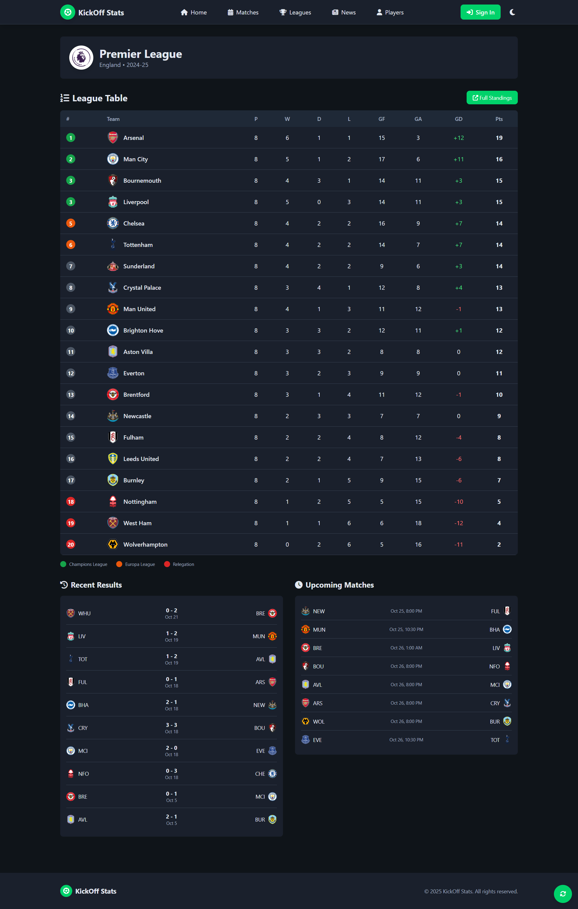
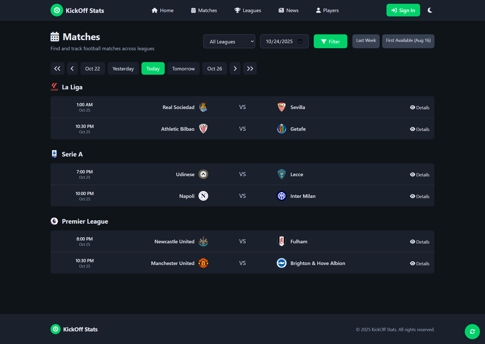
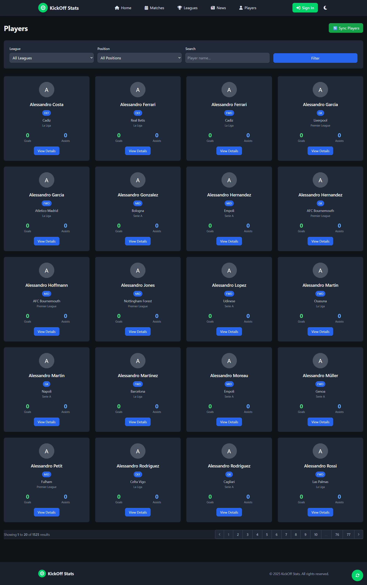
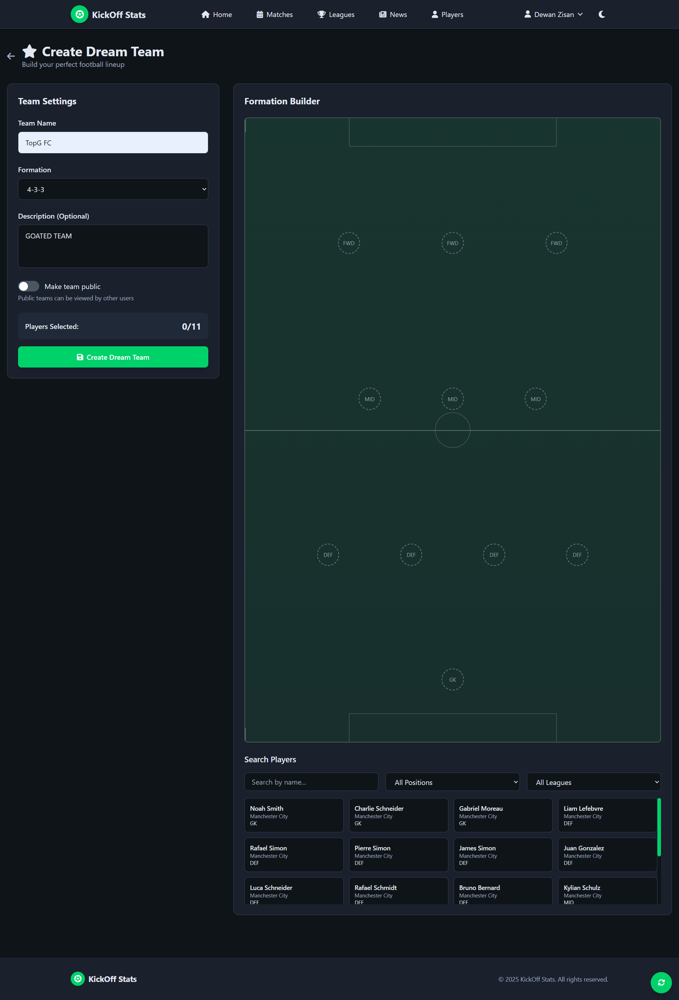
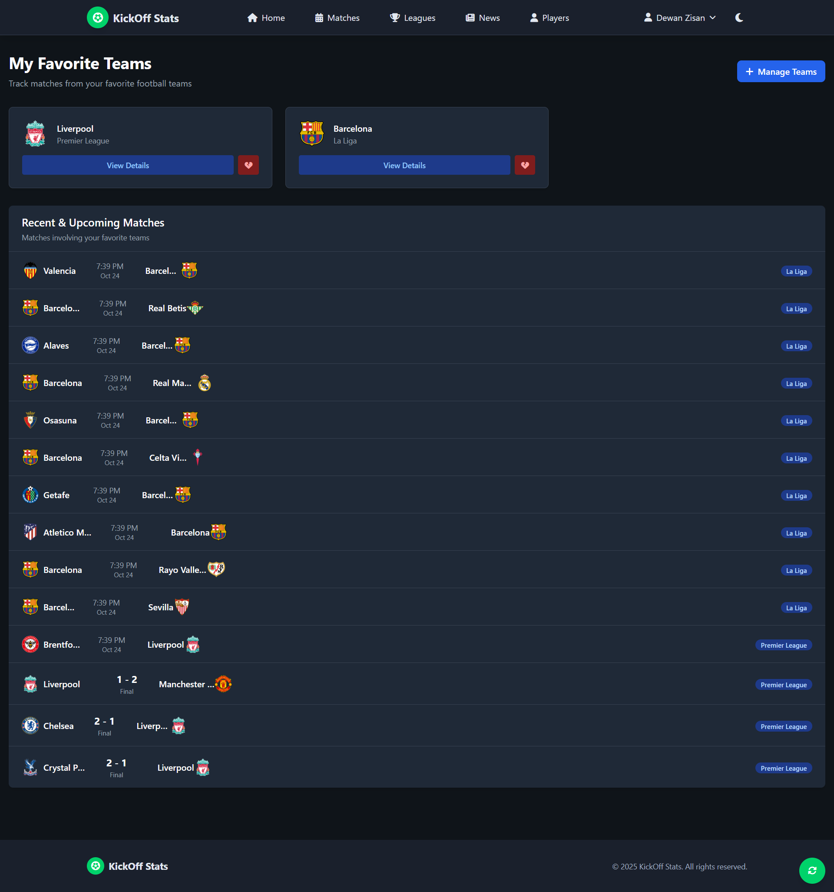
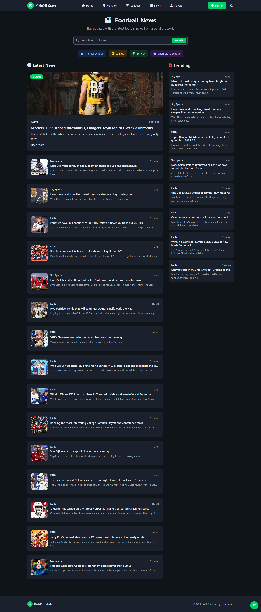

# ⚽ KickOff Stats

A comprehensive football statistics and news platform built with Laravel 12 and modern web technologies. KickOff Stats provides real-time match data, player statistics, league standings, football news, and allows users to create and manage their dream teams.


---

## 📋 Table of Contents

- [Features](#-features)
- [Screenshots](#-screenshots)
- [Tech Stack](#-tech-stack)
- [Prerequisites](#-prerequisites)
- [Installation](#-installation)
- [Configuration](#-configuration)
- [Database Setup](#-database-setup)
- [Running the Application](#-running-the-application)
- [Project Structure](#-project-structure)
- [API Integration](#-api-integration)
- [Key Features Explained](#-key-features-explained)
- [Authentication & Authorization](#-authentication--authorization)
- [Contributing](#-contributing)
- [License](#-license)
- [Contact](#-contact)

---

### Core Functionality
- � **Real-time Match Data** - Live scores and match updates
- 🏆 **League Standings** - Up-to-date league tables and statistics
- 👥 **Player Profiles** - Detailed player information and statistics
- 🏟️ **Team Information** - Comprehensive team data and squad details
- 📰 **Football News** - Latest football news with search and filtering
- ⭐ **My Teams** - Save and follow your favorite football teams
- 🎯 **Dream Team Builder** - Create and manage custom dream teams with tactical formations

### User Features
- 🔐 **User Authentication** - Secure registration and login system
- 👤 **User Profiles** - Personalized user experience
- 🔑 **Password Reset** - Email-based password recovery
- 🌓 **Dark/Light Theme** - Toggle between themes with localStorage persistence
- 📱 **Responsive Design** - Fully responsive across all devices

### Technical Features
- ⚡ **Real-time Updates** - Live score updates without page refresh
- 🔍 **Advanced Search** - Search players, teams, and news
- 🎨 **Modern UI/UX** - Clean and intuitive interface with Tailwind CSS
- 🛡️ **Custom Middleware** - Protected routes and authentication checks
- 📦 **RESTful API** - Well-structured API endpoints

---

## 📸 Screenshots

### Home Page

*The landing page featuring live scores, featured matches, and quick navigation*

### League Standings

*View comprehensive league tables and team statistics*

### Team Details

*Detailed team information including squad, fixtures, and performance stats*

### Player Profile

*Individual player statistics, biography, and career information*

### Dream Team Builder

*Create your fantasy team with interactive formation selector*

### My Teams Dashboard

*Manage and track your favorite football teams*

### Football News

*Stay updated with latest football news and trending stories*

### Authentication

*Secure user authentication with modal-based login and registration*

### Dark Mode

*Seamless dark mode toggle for comfortable viewing*

---

## 🛠️ Tech Stack

### Backend
- **Framework:** Laravel 12.x
- **PHP Version:** 8.2+
- **Database:** MySQL / SQLite
- **Authentication:** Laravel Auth with custom middleware
- **API Services:** Football-Data.org API, NewsAPI.org

### Frontend
- **CSS Framework:** Tailwind CSS v4.0
- **JavaScript:** Vanilla JS with ES6+
- **Build Tool:** Vite v7.0
- **HTTP Client:** Axios
- **Real-time Updates:** AJAX polling

### Development Tools
- **Package Manager:** Composer, npm
- **Version Control:** Git
- **Server:** XAMPP / Laravel Artisan
- **Testing:** PHPUnit

---

## 📦 Prerequisites

Before you begin, ensure you have the following installed:

- **PHP** >= 8.2
- **Composer** - [Download Here](https://getcomposer.org/)
- **Node.js** >= 18.x & npm - [Download Here](https://nodejs.org/)
- **MySQL** (or use SQLite for development)
- **XAMPP/WAMP/MAMP** (optional, for local PHP server)
- **Git** - [Download Here](https://git-scm.com/)

---

## 🚀 Installation

### 1. Clone the Repository

```bash
git clone https://github.com/ripWr3ncH/KickOff_Stats.git
cd KickOff_Stats
```

### 2. Install PHP Dependencies

```bash
composer install
```

### 3. Install JavaScript Dependencies

```bash
npm install
```

### 4. Environment Setup

Copy the example environment file:

```bash
cp .env.example .env
```

Generate application key:

```bash
php artisan key:generate
```

---

## ⚙️ Configuration

### Database Configuration

Edit your `.env` file with your database credentials:

```env
DB_CONNECTION=mysql
DB_HOST=127.0.0.1
DB_PORT=3306
DB_DATABASE=kickoffstats_db
DB_USERNAME=root
DB_PASSWORD=
```

**For SQLite (Alternative):**
```env
DB_CONNECTION=sqlite
DB_DATABASE=/absolute/path/to/database/database.sqlite
```

### API Keys Configuration

Get your free API keys and add them to `.env`:

```env
# Football Data API (https://www.football-data.org/)
FOOTBALL_DATA_API_KEY=your_football_data_api_key_here

# News API (https://newsapi.org/)
NEWS_API_KEY=your_news_api_key_here
```

**To get API keys:**
1. **Football-Data.org API:**
   - Visit [football-data.org](https://www.football-data.org/)
   - Register for a free account
   - Get your API token

2. **NewsAPI.org:**
   - Visit [newsapi.org](https://newsapi.org/)
   - Sign up for a free account
   - Copy your API key

### Session Configuration

```env
SESSION_DRIVER=database
SESSION_LIFETIME=120
```

---

## 🗄️ Database Setup

### 1. Create Database

If using MySQL, create the database:

```sql
CREATE DATABASE kickoffstats_db;
```

### 2. Run Migrations

```bash
php artisan migrate
```

This will create the following tables:
- `users` - User accounts
- `leagues` - Football leagues
- `teams` - Football teams
- `players` - Player information
- `football_matches` - Match data
- `player_stats` - Player statistics
- `dream_teams` - User-created dream teams
- `user_favorite_teams` - User favorite teams
- `password_reset_tokens` - Password reset functionality
- `sessions` - User sessions
- `cache` - Application cache
- `jobs` - Queue jobs

### 3. Seed Database (Optional)

Populate the database with sample data:

```bash
php artisan db:seed
```

---

## 🏃 Running the Application

### Development Mode

**Terminal 1 - Start Laravel Server:**
```bash
php artisan serve
```

**Terminal 2 - Start Vite Development Server:**
```bash
npm run dev
```

**Alternative (All-in-One):**
```bash
composer run dev
```

This will start:
- Laravel server at `http://localhost:8000`
- Queue listener
- Log viewer (Pail)
- Vite dev server

### Production Build

Build assets for production:

```bash
npm run build
```

---

## 📁 Project Structure

```
KickOff_Stats/
├── app/
│   ├── Http/
│   │   ├── Controllers/
│   │   │   ├── Auth/
│   │   │   │   ├── AuthController.php          # User authentication
│   │   │   │   └── PasswordResetController.php # Password reset
│   │   │   ├── Api/
│   │   │   │   └── LiveScoreController.php     # Live score API
│   │   │   ├── DreamTeamController.php         # Dream team CRUD
│   │   │   ├── HomeController.php              # Home page
│   │   │   ├── LeagueController.php            # League data
│   │   │   ├── MatchController.php             # Match data
│   │   │   ├── MyTeamsController.php           # User favorite teams
│   │   │   ├── NewsController.php              # Football news
│   │   │   ├── PlayerController.php            # Player profiles
│   │   │   └── TeamController.php              # Team information
│   │   └── Middleware/
│   │       └── AuthenticateUser.php            # Custom auth middleware
│   ├── Models/
│   │   ├── User.php                            # User model
│   │   ├── League.php                          # League model
│   │   ├── Team.php                            # Team model
│   │   ├── Player.php                          # Player model
│   │   ├── FootballMatch.php                   # Match model
│   │   ├── PlayerStat.php                      # Player statistics
│   │   └── DreamTeam.php                       # Dream team model
│   └── Services/
│       ├── FootballDataService.php             # Football API service
│       └── FootballNewsService.php             # News API service
├── database/
│   ├── migrations/                             # Database migrations
│   └── seeders/                                # Database seeders
├── resources/
│   ├── views/
│   │   ├── layouts/
│   │   │   └── app.blade.php                   # Main layout with theme toggle
│   │   ├── dashboard.blade.php                 # User dashboard
│   │   ├── welcome.blade.php                   # Landing page
│   │   └── ...                                 # Other views
│   ├── css/
│   │   └── app.css                             # Tailwind CSS
│   └── js/
│       ├── app.js                              # Main JavaScript
│       ├── bootstrap.js                        # Bootstrap config
│       └── live-scores.js                      # Live score updates
├── routes/
│   ├── web.php                                 # Web routes
│   └── console.php                             # Console commands
├── public/                                     # Public assets
├── .env                                        # Environment configuration
├── composer.json                               # PHP dependencies
├── package.json                                # Node dependencies
└── README.md                                   # This file
```

---

## 🔌 API Integration

### Football-Data.org API

The application uses Football-Data.org API for:
- Live match scores
- League standings
- Team information
- Player data
- Match schedules

**Key Service Methods:**
```php
// app/Services/FootballDataService.php
- getLiveMatches()          // Fetch live matches
- getMatchesByDate()        // Get matches by date
- getLeagueStandings()      // Retrieve league tables
- getTeamDetails()          // Get team information
- getPlayerStats()          // Fetch player statistics
```

### NewsAPI.org

The application uses NewsAPI for football news:
- Latest football news
- Trending stories
- Team-specific news
- League news
- Search functionality

**Key Service Methods:**
```php
// app/Services/FootballNewsService.php
- getLatestNews()           // Fetch latest articles
- getTrendingNews()         // Get trending stories
- searchNews()              // Search news articles
- getTeamNews()             // Team-specific news
- getLeagueNews()           // League-specific news
```

---

## 🔑 Key Features Explained

### 1. Dream Team Builder

Users can create custom dream teams with:
- **Formation Selection** - Choose from popular formations (4-3-3, 4-4-2, 3-5-2, etc.)
- **Player Search** - Search and add players from the database
- **Position Validation** - Ensure correct player positions
- **Team Management** - Full CRUD operations (Create, Read, Update, Delete)
- **JSON Storage** - Players stored as JSON in database

**Controller:** `app/Http/Controllers/DreamTeamController.php`

### 2. My Teams (Favorite Teams)

Users can:
- Browse all available teams
- Add teams to favorites
- Remove teams from favorites
- View favorite teams dashboard
- Access team details and fixtures

**Controller:** `app/Http/Controllers/MyTeamsController.php`

### 3. Authentication System

- **Modal-based Login/Register** - No separate pages needed
- **Password Hashing** - Secure password storage with `Hash::make()`
- **Session Management** - Database-driven sessions
- **Password Reset** - Email-based password recovery
- **Remember Me** - Persistent login functionality

**Controllers:** 
- `app/Http/Controllers/Auth/AuthController.php`
- `app/Http/Controllers/Auth/PasswordResetController.php`

### 4. Theme Toggle System

- **Dark/Light Modes** - Seamless theme switching
- **LocalStorage Persistence** - Survives browser restart
- **CSS Variables** - Dynamic color scheme
- **JavaScript Class** - `ThemeManager` for theme management

**Location:** `resources/views/layouts/app.blade.php`

### 5. Real-time Live Scores

- **AJAX Polling** - Automatic updates without refresh
- **Live Match Status** - Real-time score updates
- **Match Events** - Goals, cards, substitutions
- **Match Timeline** - Minute-by-minute updates

**JavaScript:** `public/js/live-scores.js`

---

## 🔐 Authentication & Authorization

### Custom Middleware

**File:** `app/Http/Middleware/AuthenticateUser.php`

The application uses custom authentication middleware (`auth.user`) to protect routes:

**Protected Routes:**
- `/my-teams/*` - Favorite teams management
- `/dream-team/*` - Dream team CRUD operations
- `/forgot-password` - Password reset
- `/reset-password` - Password reset form

**Public Routes:**
- `/login` - Login (POST)
- `/register` - Registration (POST)
- `/logout` - Logout (POST)
- `/` - Home page
- `/leagues/*` - League browsing
- `/teams/*` - Team browsing
- `/players/*` - Player browsing
- `/news/*` - News browsing

**Middleware Registration:** `bootstrap/app.php`

```php
->withMiddleware(function (Middleware $middleware) {
    $middleware->alias([
        'auth.user' => \App\Http\Middleware\AuthenticateUser::class,
    ]);
})
```

### User Registration Flow

1. User submits registration form
2. Route: `POST /register`
3. Controller validates input (unique email, password confirmation)
4. Password hashed with `Hash::make()`
5. User created: `User::create()`
6. Automatic login: `Auth::login($user)`
7. Redirect to dashboard with success message

---

## 🎨 UI/UX Features

- **Responsive Design** - Works on all devices (mobile, tablet, desktop)
- **Tailwind CSS v4** - Modern utility-first CSS framework
- **Interactive Components** - Smooth animations and transitions
- **Loading States** - User feedback during API calls
- **Error Handling** - Friendly error messages
- **Toast Notifications** - Real-time user feedback
- **Modal Windows** - Login/register without page navigation
- **Search Autocomplete** - Player search with suggestions
- **Formation Visualizer** - Interactive football pitch diagram

---

## 📊 Database Schema

### Key Tables

**users**
- User accounts and authentication

**leagues**
- Football leagues (Premier League, La Liga, etc.)

**teams**
- Football teams with league associations

**players**
- Player profiles and information

**football_matches**
- Match data with home/away teams

**player_stats**
- Player performance statistics

**dream_teams**
- User-created fantasy teams (JSON players)

**user_favorite_teams**
- Many-to-many relationship (users ↔ teams)

---

## 🧪 Testing

Run the test suite:

```bash
php artisan test
```

Or using PHPUnit directly:

```bash
./vendor/bin/phpunit
```

---

## 🤝 Contributing

Contributions are welcome! Please follow these steps:

1. **Fork the repository**
2. **Create a feature branch**
   ```bash
   git checkout -b feature/AmazingFeature
   ```
3. **Commit your changes**
   ```bash
   git commit -m 'Add some AmazingFeature'
   ```
4. **Push to the branch**
   ```bash
   git push origin feature/AmazingFeature
   ```
5. **Open a Pull Request**

### Code Style

- Follow PSR-12 coding standards
- Use meaningful variable and function names
- Comment complex logic
- Write tests for new features

---

## 📝 License

This project is licensed under the MIT License. See the [LICENSE](LICENSE) file for details.

---

## �‍💻 Developer

**Developed by:** [ripWr3ncH](https://github.com/ripWr3ncH)

**Project Link:** [KickOff Stats](https://github.com/ripWr3ncH/KickOff_Stats)

---

## 📧 Contact

For questions, suggestions, or issues:

- **GitHub Issues:** [Create an Issue](https://github.com/ripWr3ncH/KickOff_Stats/issues)
- **GitHub Profile:** [@ripWr3ncH](https://github.com/ripWr3ncH)

---

## 🙏 Acknowledgments

- **Laravel Framework** - The PHP framework for web artisans
- **Football-Data.org** - Comprehensive football data API
- **NewsAPI.org** - Breaking news API
- **Tailwind CSS** - Utility-first CSS framework
- **Vite** - Next generation frontend tooling

---

## � Future Enhancements

- [ ] Player comparison tool
- [ ] Live chat for matches
- [ ] Social sharing features
- [ ] Email notifications for favorite teams
- [ ] Advanced statistics and analytics
- [ ] Multi-language support
- [ ] Mobile app (iOS/Android)
- [ ] Fantasy league competition system
- [ ] Betting odds integration
- [ ] Video highlights integration

---

## 🐛 Known Issues

- Free API tier has rate limits (Football-Data.org: 10 requests/minute)
- News API free plan doesn't support `/top-headlines` sorting by popularity
- Live scores require manual polling (WebSocket implementation pending)

---

## � Documentation

For more detailed documentation, visit the [Wiki](https://github.com/ripWr3ncH/KickOff_Stats/wiki).

---

<div align="center">

**⭐ Star this repository if you find it helpful! ⭐**

Made with ❤️ and ☕ by [ripWr3ncH](https://github.com/ripWr3ncH)

</div>


## Laravel Sponsors

We would like to extend our thanks to the following sponsors for funding Laravel development. If you are interested in becoming a sponsor, please visit the [Laravel Partners program](https://partners.laravel.com).

### Premium Partners

- **[Vehikl](https://vehikl.com)**
- **[Tighten Co.](https://tighten.co)**
- **[Kirschbaum Development Group](https://kirschbaumdevelopment.com)**
- **[64 Robots](https://64robots.com)**
- **[Curotec](https://www.curotec.com/services/technologies/laravel)**
- **[DevSquad](https://devsquad.com/hire-laravel-developers)**
- **[Redberry](https://redberry.international/laravel-development)**
- **[Active Logic](https://activelogic.com)**

## Contributing

Thank you for considering contributing to the Laravel framework! The contribution guide can be found in the [Laravel documentation](https://laravel.com/docs/contributions).

## Code of Conduct

In order to ensure that the Laravel community is welcoming to all, please review and abide by the [Code of Conduct](https://laravel.com/docs/contributions#code-of-conduct).

## Security Vulnerabilities

If you discover a security vulnerability within Laravel, please send an e-mail to Taylor Otwell via [taylor@laravel.com](mailto:taylor@laravel.com). All security vulnerabilities will be promptly addressed.

## License

The Laravel framework is open-sourced software licensed under the [MIT license](https://opensource.org/licenses/MIT).
# KickOff_Stats

